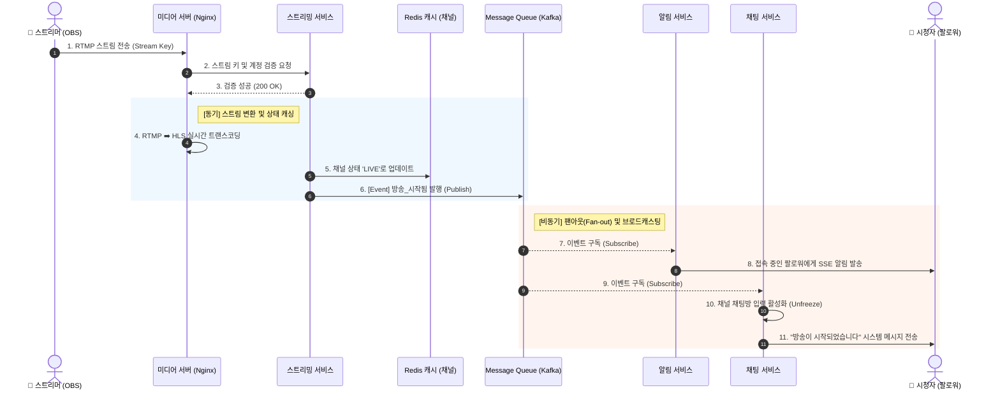
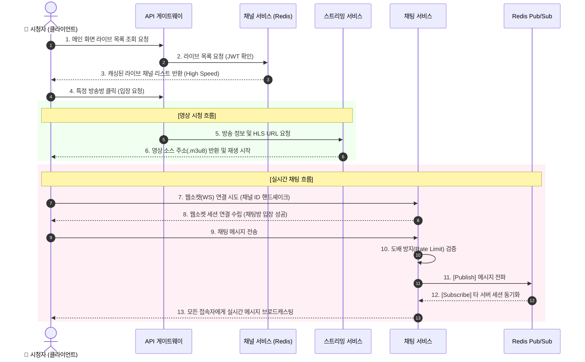

# 📌 유저 시나리오 (User Scenario)

## 1. 스트리머 방송 시작 시나리오 (Streamer - Go Live)

**[사전 조건]**
* 스트리머는 회원가입 및 로그인을 완료한 상태이다.
* 스트리머는 마이페이지(대시보드)에서 자신의 고유한 '스트림 키(Stream Key)'를 발급받아 알고 있다.

**[진행 흐름]**
1. **[스트리머]** 외부 송출 프로그램(OBS Studio 등)을 실행한다.
2. **[스트리머]** 방송 설정 메뉴에서 플랫폼의 RTMP 서버 주소와 자신의 '스트림 키'를 입력한다.
3. **[스트리머]** OBS에서 '방송 시작' 버튼을 클릭하여 서버로 비디오/오디오 스트림 전송을 시작한다.
4. **[시스템]** 미디어 서버가 RTMP 스트림을 수신하고, 백엔드 API를 호출하여 스트림 키의 유효성과 계정 상태를 검증한다.
5. **[시스템]** 검증이 완료되면, 수신된 원본 영상을 HLS 포맷(.m3u8, .ts)으로 실시간 변환(트랜스코딩)하기 시작한다.
6. **[시스템]** 해당 스트리머의 채널 상태를 '라이브 중(ON)'으로 변경하고, 메인 화면 조회를 위해 Redis 캐시에 라이브 채널 정보를 등록한다.
7. **[시스템]** 메시지 큐(Kafka/RabbitMQ)를 통해 '방송 시작됨' 이벤트를 발행한다.
8. **[시스템]** 알림 서비스가 이벤트를 구독하여, 스트리머를 팔로우하는 유저 중 현재 온라인 상태인 유저들에게 SSE(Server-Sent Events)를 통해 실시간 푸시 알림을 발송한다.
9. **[시스템]** 해당 채널의 채팅방(WebSocket) 입력을 활성화하고, 브로드캐스팅을 통해 "방송이 시작되었습니다"라는 시스템 메시지를 전송한다.

**[종료 상태]**
* 메인 화면의 라이브 목록에 스트리머의 방송이 노출된다.
* 시청자들이 채널에 입장하여 HLS 영상을 시청하고 채팅을 입력할 수 있게 된다.

# 📌 시스템 시퀀스 다이어그램 (방송 시작 로직)

## 2. 시청자 방송 시청 및 채팅 시나리오 (Viewer - Watch & Chat)

**[사전 조건]**
* 시청자(회원)는 로그인을 완료하고 JWT 토큰을 보유한 상태이다.
* 특정 스트리머가 현재 라이브 방송을 진행 중(ON)이다.

**[진행 흐름]**
1. **[시청자]** 플랫폼 메인 화면에 접속하여 현재 라이브 중인 방송 목록을 확인한다.
2. **[시스템]** 메인 화면 요청 시, RDBMS가 아닌 Redis 캐시에서 현재 라이브 중인 채널 리스트를 초고속으로 조회하여 시청자에게 보여준다.
3. **[시청자]** 목록에서 원하는 스트리머의 방송을 클릭하여 방송방에 입장한다.
4. **[시스템]** 스트리밍 서비스는 해당 채널의 실시간 영상 재생을 위한 HLS URL(.m3u8)을 클라이언트에 제공한다.
5. **[시스템]** 동시에 채팅 서비스는 시청자가 접속할 채팅방 웹소켓(WebSocket) 엔드포인트 주소를 전달한다.
6. **[시청자]** 비디오 플레이어를 통해 실시간 HLS 영상 시청을 시작한다.
7. **[시청자]** 클라이언트가 채팅 서버와 웹소켓 연결을 성공적으로 맺고, 해당 스트리머 채널 ID 기반의 채팅방 세션에 진입한다.
8. **[시청자]** 채팅창에 응원 메시지를 입력하고 전송 버튼을 누른다.
9. **[시스템]** 채팅 서버는 도배 방지(Rate Limiting) 필터를 거친 후, Redis Pub/Sub을 통해 분산된 다른 채팅 서버들에게 메시지를 전파(Broadcasting)하여 해당 방에 있는 모든 시청자에게 실시간으로 메시지를 노출한다.

**[종료 상태]**
* 시청자는 실시간 비디오를 끊김 없이 시청하며 다른 시청자들과 실시간으로 채팅을 주고받는다.
