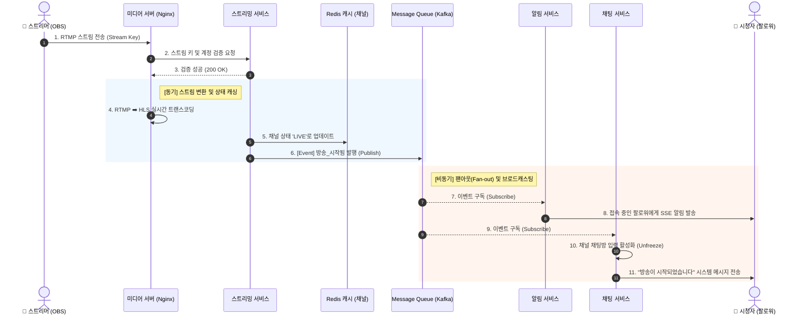

# 📌 유저 시나리오 (User Scenario)

## 1. 스트리머 방송 시작 시나리오 (Streamer - Go Live)

**[사전 조건]**
* 스트리머는 회원가입 및 로그인을 완료한 상태이다.
* 스트리머는 마이페이지(대시보드)에서 자신의 고유한 '스트림 키(Stream Key)'를 발급받아 알고 있다.

**[진행 흐름]**
1. **[스트리머]** 외부 송출 프로그램(OBS Studio 등)을 실행한다.
2. **[스트리머]** 방송 설정 메뉴에서 플랫폼의 RTMP 서버 주소와 자신의 '스트림 키'를 입력한다.
3. **[스트리머]** OBS에서 '방송 시작' 버튼을 클릭하여 서버로 비디오/오디오 스트림 전송을 시작한다.
4. **[시스템]** 미디어 서버가 RTMP 스트림을 수신하고, 백엔드 API를 호출하여 스트림 키의 유효성과 계정 상태를 검증한다.
5. **[시스템]** 검증이 완료되면, 수신된 원본 영상을 HLS 포맷(.m3u8, .ts)으로 실시간 변환(트랜스코딩)하기 시작한다.
6. **[시스템]** 해당 스트리머의 채널 상태를 '라이브 중(ON)'으로 변경하고, 메인 화면 조회를 위해 Redis 캐시에 라이브 채널 정보를 등록한다.
7. **[시스템]** 메시지 큐(Kafka/RabbitMQ)를 통해 '방송 시작됨' 이벤트를 발행한다.
8. **[시스템]** 알림 서비스가 이벤트를 구독하여, 스트리머를 팔로우하는 유저 중 현재 온라인 상태인 유저들에게 SSE(Server-Sent Events)를 통해 실시간 푸시 알림을 발송한다.
9. **[시스템]** 해당 채널의 채팅방(WebSocket) 입력을 활성화하고, 브로드캐스팅을 통해 "방송이 시작되었습니다"라는 시스템 메시지를 전송한다.

**[종료 상태]**
* 메인 화면의 라이브 목록에 스트리머의 방송이 노출된다.
* 시청자들이 채널에 입장하여 HLS 영상을 시청하고 채팅을 입력할 수 있게 된다.

# 📌 시스템 시퀀스 다이어그램 (방송 시작 로직)

