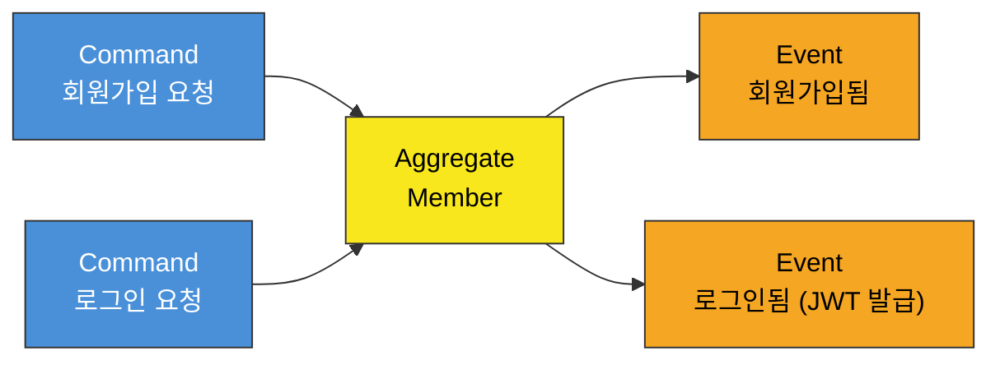
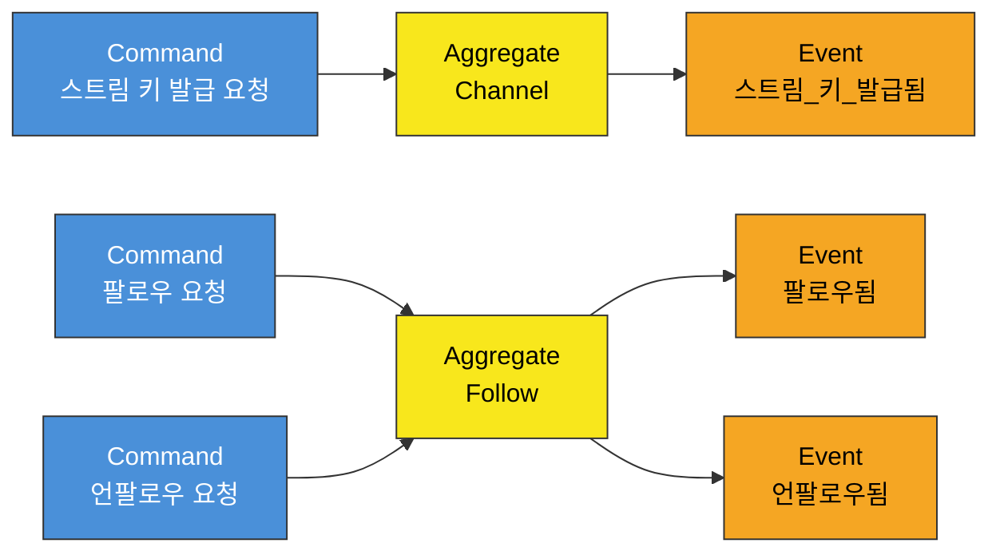
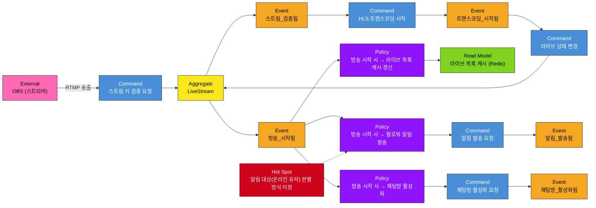
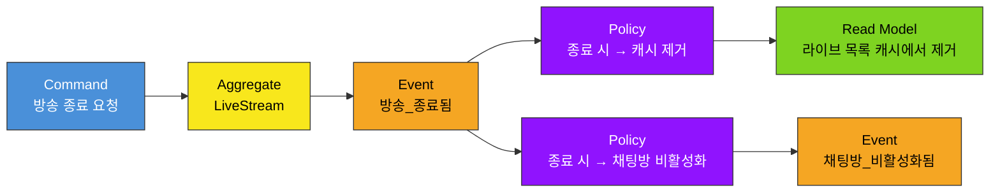
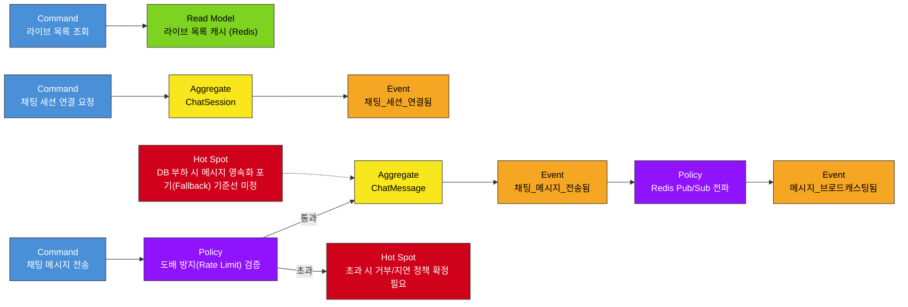

# 📌 이벤트 스토밍 (Event Storming)

> `1_requirements`의 유저 시나리오·MVP 스코프를 기반으로 도메인 이벤트를 도출하고, 이를 근거로 Bounded Context(= MSA 서비스 후보)를 확정한다.

## 범례 (Legend)

| 색상 | 요소 | 의미 |
|---|---|---|
| 🟦 파랑 | Command | 액터가 시스템에 요청하는 행위 |
| 🟧 주황 | Domain Event | Command 처리 결과로 발생한 사실 (과거형) |
| 🟨 노랑 | Aggregate | Command를 처리하고 Event를 발생시키는 도메인 객체 |
| 🟪 보라 | Policy | "이 이벤트가 발생하면 → 저 Command를 실행한다" 는 반응 규칙 (서비스 간 경계에서 주로 발생) |
| 🟩 초록 | Read Model | 조회 전용 뷰 (여기선 대부분 Redis 캐시) |
| 🟥 분홍 | External System | 외부 시스템 (OBS 등) |
| 🟥 빨강 | Hot Spot | 설계 시점에 결정이 안 되어 이후 단계에서 반드시 확정해야 하는 이슈 |

---

## 1. 인증 (Auth)

* **소유 Context 후보:** Auth

---

## 2. 채널 준비 (스트림 키 발급 / 팔로우)

* **소유 Context 후보:** Channel

---

## 3. 방송 시작 (Go Live) — 팬아웃의 시작점

* **관련 Context 후보:** Streaming(발행) → Channel / Notification / Chat (구독)
* 이 지점이 **MSA 경계 + 비동기 이벤트 통신**이 실제로 발생하는 핵심 구간이다 (`.clauderules` 3번 원칙과 직결).

---

## 4. 방송 종료 (End Live)

---

## 5. 시청 및 실시간 채팅 (Viewer)

---

## Bounded Context 도출 결과

이벤트 스토밍에서 나온 Aggregate를 응집도(같이 생성/변경되는 단위) 기준으로 묶어 MSA 서비스 경계 후보를 확정한다. `.clauderules`에 명시된 예상 서비스(Auth, Streaming, Channel, Chat, Notification)와 일치함을 확인했다.

| Context (서비스 후보) | Aggregate | 소유 이벤트 | 비고 |
|---|---|---|---|
| **Auth** | Member | 회원가입됨, 로그인됨 | JWT 발급 주체 |
| **Channel** | Channel, Follow | 스트림_키_발급됨, 팔로우됨, 언팔로우됨 | 라이브 목록 Read Model(Redis) 소유 |
| **Streaming** | LiveStream | 스트림_검증됨, 트랜스코딩_시작됨, 방송_시작됨, 방송_종료됨 | RTMP 수신·HLS 변환, 팬아웃의 발행 주체 |
| **Chat** | ChatSession, ChatMessage | 채팅방_활성화됨, 채팅방_비활성화됨, 채팅_세션_연결됨, 채팅_메시지_전송됨, 메시지_브로드캐스팅됨 | Redis Pub/Sub 기반 멀티 서버 브로드캐스팅 |
| **Notification** | Notification | 알림_발송됨 | SSE 비동기 팬아웃 |

## 서비스 간 이벤트 흐름 (system_architecture.md 선행 근거)

| 발행 Context | Event | 구독 Context | Policy |
|---|---|---|---|
| Streaming | 방송_시작됨 | Channel | 라이브 목록 캐시 갱신 |
| Streaming | 방송_시작됨 | Notification | 팔로워 알림 발송 |
| Streaming | 방송_시작됨 | Chat | 채팅방 활성화 |
| Streaming | 방송_종료됨 | Channel | 라이브 목록 캐시 제거 |
| Streaming | 방송_종료됨 | Chat | 채팅방 비활성화 |

→ Streaming이 이벤트 발행자(Publisher), Channel/Notification/Chat이 구독자(Subscriber)가 되는 구조. 이 팬아웃 지점에 Message Queue(Kafka/RabbitMQ)가 위치한다.

## Hot Spot (다음 단계에서 반드시 확정할 이슈)

| # | 이슈 | 확정 시점 |
|---|---|---|
| 1 | 알림 대상(온라인 유저) 판별 방식 — 커넥션 레지스트리 필요 여부 | `system_architecture.md` |
| 2 | MQ 종류 선택 (Kafka vs RabbitMQ) | ✅ 해소 — Kafka 채택 ([ADR-0004](adr/0004-message-broker-selection.md)) |
| 3 | 채팅 도배 방지 초과 시 거부/지연 등 구체적 처리 방식 | `api_specification.md` |
| 4 | DB 부하 시 채팅 메시지 영속화 포기 기준선(Fallback 트리거 조건) | `system_architecture.md` |
| 5 | 스트림 키 검증 책임 주체 (Streaming 자체 검증 vs Auth 위임) | `system_architecture.md` |
